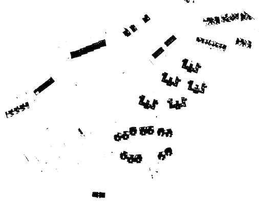

## Semantic segmentation for aeral imaging

This framework provides code for training and inference of a semantic segmentation neural network.
The task is binary semantic segmentation. The loss used is pixelwise cross-entropy.

The source image is sampled with 256x256 random patches which are fed in batches of 16 to the network. During training batch normalisation is used to regularize the network and facilitate faster convergence. In the case the network is made bigger, group normalization can be use instead of batch normalization.

During the inference procedure a potentially big input image is split into overlapping tiles. The tiles are processed separately and then composed together to form a big segmentation image. File predict.py contains an example that loads a default snapshot and performs inference on an arbitrary image. A separate multi-processing based DataLoader is used to come over a virtual dataset that consists of tiles (InferenceDataset).

Accuracy is estimated as intersection over union (IoU) metric which is about 0.7 for this shallow network with very small receptive field and number of parameters.

Prediction on the full image:



### Installation

Environment can be created out of the provided anaconda environmnet YML file.
```
conda env create -f environment.yml
conda activate tiled_segmentation
```

To run evaluation:
```
python predict.py
```
The output is in output.png.

To run training:
```
python train.py
```
